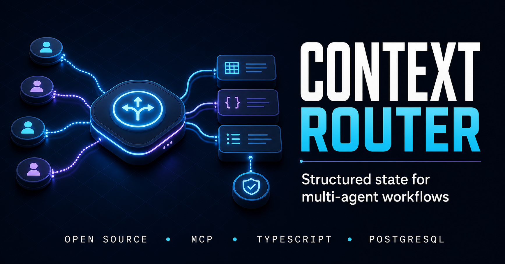

<p align="center">
  
</p>

<h1 align="center">Context Router</h1>

<p align="center">
  <strong>Clean state in. Focused context out.</strong>
</p>

<p align="center">
  A local MCP server that gives multi-agent workflows structured state,
  schema validation, selective reads, durable checkpoints, and concise handoffs.
</p>

<p align="center">
  <a href="./LICENSE"></a>
  
  
  
  
</p>

---

## The problem

Multi-agent systems often pass entire chat histories from one agent to the
next. That means every downstream agent inherits:

- irrelevant reasoning and dead ends;
- contradictory intermediate answers;
- larger prompts and repeated token costs;
- no durable recovery point when a step fails.

Context Router replaces that growing conversation chain with a small,
purpose-built state layer.

| Without Context Router        | With Context Router                   |
| ----------------------------- | ------------------------------------- |
| Pass complete chat histories  | Pass only validated state             |
| Every agent sees everything   | Agents read only the keys they need   |
| Failures restart the pipeline | Checkpoints preserve completed work   |
| Context grows at every step   | Handoffs remain concise and bounded   |
| State shape is implicit       | Schemas make state contracts explicit |

## How it works

```text
 Agent A                  Context Router                  Agent B
┌─────────┐              ┌────────────────┐             ┌─────────┐
│ Reason  │──write──────▶│ Structured     │──select────▶│ Reason  │
│ & act   │              │ workflow state │             │ & act   │
└─────────┘              │                │             └─────────┘
                         │  ✓ schemas     │
                         │  ✓ versions    │
                         │  ✓ checkpoints │
                         │  ✓ handoffs    │
                         └───────┬────────┘
                                 │
                                 ▼
                       SQLite / PostgreSQL
```

Context Router does **not** execute or orchestrate agents. It gives any
MCP-compatible agent system a reliable place to exchange workflow state.

## What you get

- **29 MCP tools** across workspaces, schemas, workflows, state, checkpoints,
  handoffs, step execution, and agent roles
- **Schema-enforced state** with nested objects, arrays, enums, and required fields
- **Selective context reads** so each agent receives only relevant state keys
- **Explicit workflow lifecycles** with running, completed, and failed states
- **Visible state versions** on every update
- **Transactional restores** that apply checkpoint snapshots atomically
- **Bounded handoff summaries** generated from selected or complete workflow state
- **Workspace-scoped persistence** for safe local project separation
- **TypeScript SDK** with a simple workflow session and the full explicit API
- **Python SDK** (v0.4.0) with the same workflow session and MCP tool surface
- **Zero-configuration local runtime** with SQLite by default and PostgreSQL for production

## Quickstart

You need Node.js 20 or newer. No database, Docker installation, migration, or
environment file is required.

```bash
npm install @context-router/sdk
```

```typescript
import { ContextRouter } from '@context-router/sdk';

const router = await ContextRouter.local();
const flow = await router.start('Research');
await flow.set('findings', { answer: 42, source: 'example' });
console.log((await flow.handoff({ keys: ['findings'] })).summary);
await flow.complete();
await router.close();
```

SQLite is created automatically in your operating system's application-data
directory. Inspect the resolved location and installation health at any time:

```bash
npx context-router doctor
npx context-router status
```

Context Router stores and transfers workflow state. It does not execute agents.

## Start here

Pick the workflow pattern that matches your use case:

| Pattern                     | Guide                                                                  | Example                                        |
| --------------------------- | ---------------------------------------------------------------------- | ---------------------------------------------- |
| Linear agent chain          | [docs/workflows/simple-pipeline.md](docs/workflows/simple-pipeline.md) | `node scripts/run-example.mjs simple-pipeline` |
| Parallel fan-out + merge    | [docs/workflows/parallel-merge.md](docs/workflows/parallel-merge.md)   | `node scripts/run-example.mjs parallel-merge`  |
| Checkpoint retry / recovery | [docs/workflows/retry-recovery.md](docs/workflows/retry-recovery.md)   | `node scripts/run-example.mjs retry-recovery`  |

The recommended SDK entry point is `ContextRouter.local()` and `router.start()` — you do not need to learn all 29 MCP tools to get started.

## Runnable examples

Requires Node.js 20+ and a built SDK (`npm run build` from this repository).

### Simple Pipeline

[examples/simple-pipeline.ts](examples/simple-pipeline.ts) — Linear agent chain

```bash
node scripts/run-example.mjs simple-pipeline
```

### Parallel Merge

[examples/parallel-merge.ts](examples/parallel-merge.ts) — Fan-out to multiple agents, merge results

```bash
node scripts/run-example.mjs parallel-merge
```

### Retry Recovery

[examples/retry-recovery.ts](examples/retry-recovery.ts) — Checkpoint-based retry with state restoration

```bash
node scripts/run-example.mjs retry-recovery
```

You can also run an example directly with `node --experimental-strip-types examples/simple-pipeline.ts`.

## Connect an MCP client

To use the raw MCP surface instead of the SDK, add the server to a client that
supports local stdio MCP servers. SQLite remains the default:

```json
{
  "mcpServers": {
    "context-router": {
      "command": "npx",
      "args": ["-y", "@context-router/mcp-server"]
    }
  }
}
```

For PostgreSQL, set `DATABASE_URL`, run the included Prisma migrations, and then
start the server. `CONTEXT_ROUTER_OWNER_ID` is a trusted-local isolation scope,
not a remote authentication credential.

## The workflow lifecycle

```text
workspace_ensure / workspace_create
  -> schema_create (optional)
  -> workflow_create
  -> state_write
  -> checkpoint_create
  -> state_read / handoff_generate
  -> checkpoint_restore (when needed)
  -> workflow_complete
```

### Explicit TypeScript SDK

```typescript
import { ContextRouter } from '@context-router/sdk';

const router = await ContextRouter.local();

const workspace = await router.workspace.create('Lead qualification');

await router.schema.create(workspace.id, 'Lead', {
  companyName: { type: 'string', required: true },
  domain: { type: 'string', required: true },
  status: {
    type: 'enum',
    values: ['PENDING', 'CONFIRMED', 'REJECTED'],
    required: true,
  },
});

const workflow = await router.workflow.create(workspace.id);

await router.state.write(
  workspace.id,
  workflow.id,
  'lead',
  {
    companyName: 'Acme Corp',
    domain: 'acme.example',
    status: 'CONFIRMED',
  },
  { schemaName: 'Lead' },
);

await router.checkpoint.create(workspace.id, workflow.id, {
  label: 'validated-lead',
});

const handoff = await router.handoff.generate(workspace.id, workflow.id, {
  keys: ['lead'],
  maxTokens: 100,
});

console.log(handoff.summary);

await router.workflow.complete(workspace.id, workflow.id);
await router.disconnect();
```

See the complete
[lead qualification example](examples/lead-qualification.ts).

## MCP tool surface

<details>
<summary><strong>View all 29 tools</strong></summary>

| Area       | Tools                                                                                         |
| ---------- | --------------------------------------------------------------------------------------------- |
| Router     | `router_status`                                                                               |
| Workspace  | `workspace_create`, `workspace_ensure`, `workspace_list`, `workspace_get`, `workspace_delete` |
| Schema     | `schema_create`, `schema_get`, `schema_list`, `schema_validate`                               |
| Workflow   | `workflow_create`, `workflow_status`, `workflow_complete`, `workflow_fail`                    |
| State      | `state_write`, `state_read`, `state_delete`, `state_snapshot`                                 |
| Checkpoint | `checkpoint_create`, `checkpoint_list`, `checkpoint_restore`, `checkpoint_delete`             |
| Handoff    | `handoff_generate`, `handoff_apply`                                                           |
| Step       | `step_run_start`, `step_run_complete`, `step_run_fail`                                        |
| Agent role | `agent_role_create`, `agent_role_list`                                                        |

Every tool returns one stable JSON envelope:

```json
{ "success": true, "data": {} }
```

```json
{
  "success": false,
  "error": {
    "code": "WORKFLOW_NOT_FOUND",
    "message": "Workflow was not found in the workspace"
  }
}
```

</details>

Read the complete [MCP API reference](docs/api.md).

## Project structure

```text
context-router/
├── packages/
│   ├── server/           # MCP server, tools, Prisma client and migrations
│   ├── sdk-typescript/   # Publishable TypeScript SDK
│   └── sdk-python/       # Experimental, unpublished prototype
├── examples/             # End-to-end usage examples
├── docs/                 # Architecture, API, roadmap and release docs
├── scripts/              # MCP smoke checks
└── docker-compose.yml    # Optional local PostgreSQL 16
```

## Current status

Context Router is an **early open-source preview**.

Already working:

- TypeScript build and type-checking
- unit and SDK contract tests
- MCP discovery smoke test for all 29 tools
- SQLite and PostgreSQL integration test suites in CI
- clean npm package generation
- zero known production dependency vulnerabilities

Deliberately outside `v0.3.0`:

- remote MCP transport;
- hosted authentication and multi-tenancy;
- billing or managed infrastructure;
- automatic agent execution (Context Router records steps but does not invoke agents);
- published Python SDK.

Please do not expose the stdio server directly to an untrusted network.

## Roadmap

- **v0.1:** trusted-local MCP server, PostgreSQL storage, TypeScript SDK
- **v0.2:** CAS writes, step execution, agent roles, provenance, structured handoffs
- **v0.3:** SQLite default, Node 20+, local workflow SDK, doctor/status CLI
- **v0.4 candidate:** Python SDK, more workflow templates, integration adapters
- **Later evaluation:** remote transport, authentication, observability, hosted deployment

See the detailed [roadmap](docs/roadmap.md).

## Contributing

Issues, documentation improvements, examples, tests, and focused pull requests
are welcome. Start with [CONTRIBUTING.md](CONTRIBUTING.md) and review the
[Code of Conduct](CODE_OF_CONDUCT.md).

If you find a security issue, follow [SECURITY.md](SECURITY.md) instead of
opening a public issue.

## Documentation

- [Architecture](docs/architecture.md)
- [MCP tool API](docs/api.md)
- [Roadmap](docs/roadmap.md)
- [Release checklist](docs/release-checklist.md)
- [Changelog](CHANGELOG.md)

## License

Context Router is available under the
[Apache License 2.0](LICENSE).

---

<p align="center">
  <strong>Build agents that share facts not noise.</strong>
</p>
